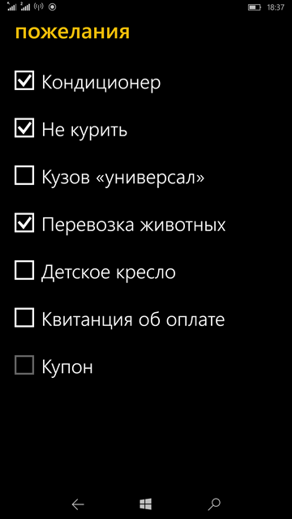
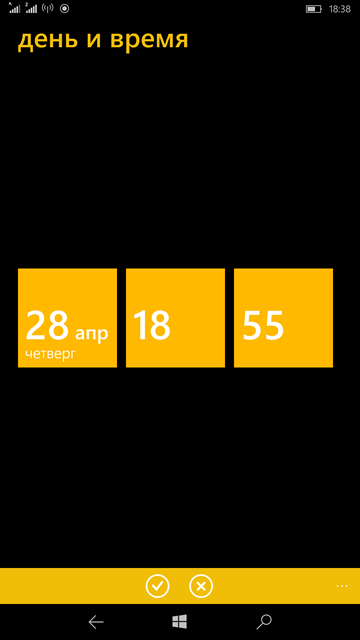

# Yata (Yandex.Taxi; "Project YaTa" codename)

## About
Discontinued Yandex.Taxi [WP7.5/WP8] R.E./ micro-RnD  

## Goal
Some lite WP8->UWP transformation & mini-research.

## Screenshots

## Tech. moments
- App class: uwp 
- Target Platform Version: 10.0.10586.0
- Target Platform Min. Version: 10.0.10586.0

## App Architecture / Progress
- Yandex.Taxi [UWP; blank/empty app at now, no success to decomp.]
- Yandex.Maps.Recording [UWP; decompiled by DotPeeks]
- Yandex.MapKit [UWP; decompiled by DotPeeks]
- Yandex.Runtime [UWP;  decompiled by DotPeeks]
- LiveTileTask [UWP;  decompiled by DotPeeks]

## Reference(s)
https://taxi.yandex.ru/

## .
As is. No support. Learn / Research purposes only!

## ..
-- mediaexplorer 2024
